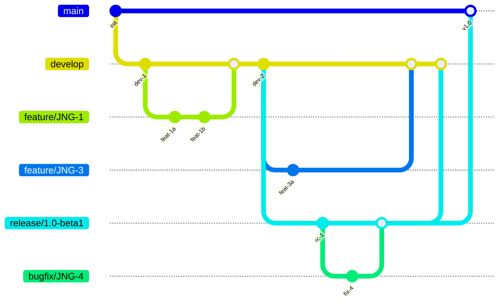
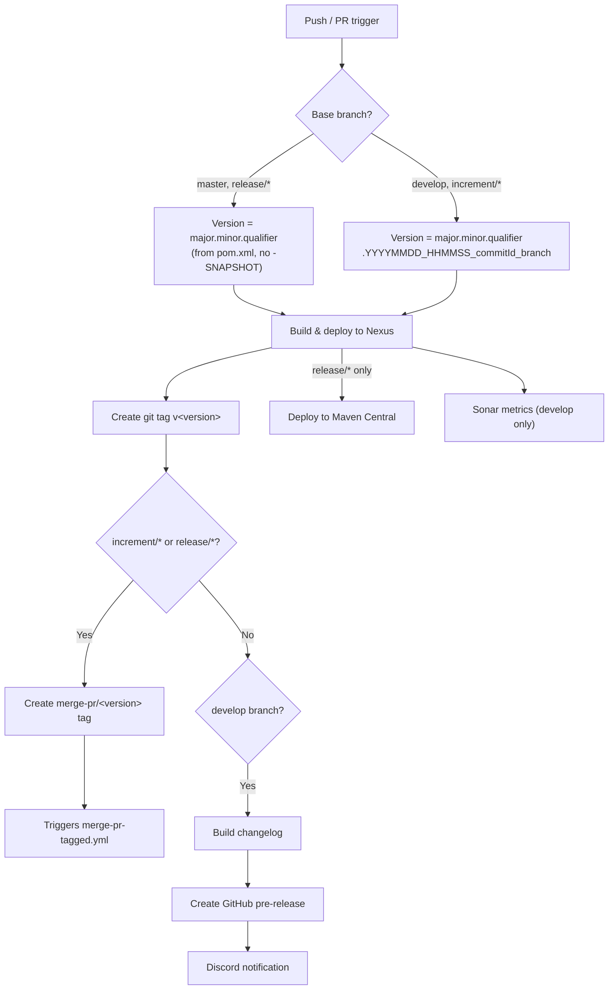
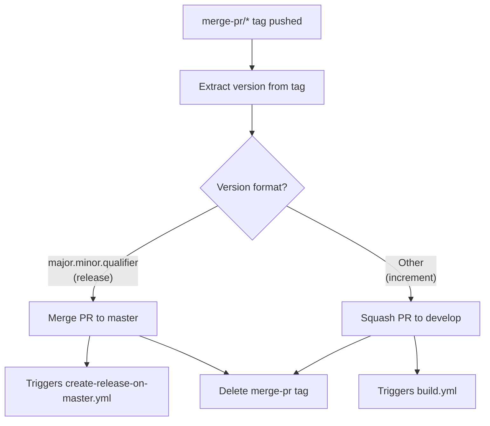
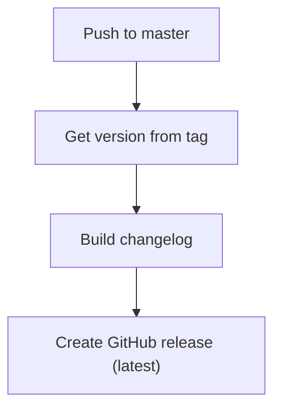
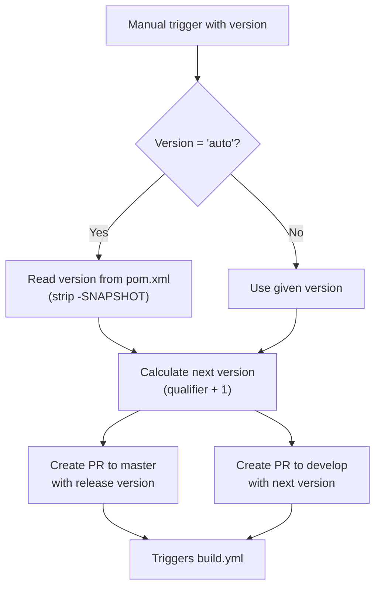

# CI/CD Flow — Development Version and Branch Handling

This document describes the branching strategy, versioning policy, and GitHub Actions CI/CD workflows used by this project.

## Branching Strategy

The project follows [GitFlow](https://www.atlassian.com/git/tutorials/comparing-workflows/gitflow-workflow):

| Branch Pattern | Purpose | Based On |
|---------------|---------|----------|
| `develop` | Main development branch; contains latest development sources | — |
| `feature/JNG-xxx_summary` | New feature development | `develop` |
| `release/x.y.z` | Release stabilization (`release/` prefix reserved for CI) | `develop` |
| `bugfix/JNG-xxx_summary` | Bug fixes during release testing | release branch |
| `support/JNG-xxx_summary` | Minor changes to a previous release | release branch |
| `master` | Latest production release | release branch (via merge) |
| `hotfix/JNG-xxx_summary` | Urgent fixes to production | `master` |

### Branch Flow

## Version Numbers

Versions follow semantic versioning with these rules:

| Event | Version Change |
|-------|---------------|
| Start a `feature/` branch | No change |
| Start a `release/` branch | Increment 2nd number on `develop` |
| Start a `bugfix/` branch | No change (applied on release branch before merge to master) |
| Start a `support/` branch | Increment 3rd number |
| Start a `hotfix/` branch | Increment 4th number (applied to both release and master) |

## GitHub Actions Workflows

### build.yml — Main Build Pipeline

Triggers on pushes to `develop` and pull requests to `develop`, `master`, `increment/*`, `release/*`.

### merge-pr-tagged.yml — PR Auto-Merge

Triggers when a `merge-pr/*` tag is pushed.

### create-release-on-master.yml — Release Finalization

Triggers on pushes to `master`.

### release.yml — Manual Release Trigger

Manually triggered with a version parameter (`auto` or `major.minor.qualifier`).

## Development Rules

> **Important:** There is no commit without a ticket number. Every pull request and commit must include a Jira ticket reference (`JNG-xxx`).

Issue tracking: [JIRA](https://blackbelt.atlassian.net/jira/dashboards)
