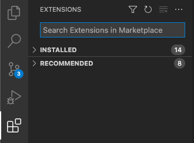
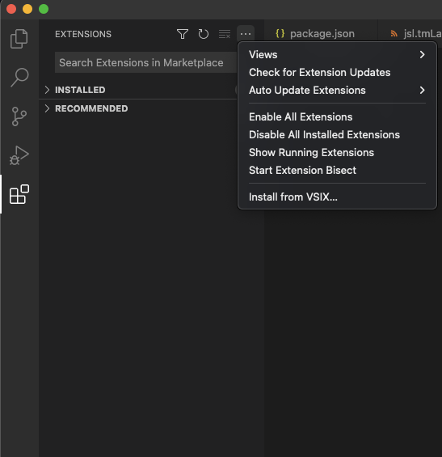
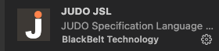

= judo-jsl-vscode

image::https://github.com/BlackBeltTechnology/judo-jsl-vscode/actions/workflows/build.yml/badge.svg?branch=develop[link="https://github.com/BlackBeltTechnology/judo-jsl-vscode/actions/workflows/build.yml" float="center"]

== Introduction

The JSL VSCode plugin provides smart editing features for JUDO Specific Language aka JSL.

_(The frontend plugin build is part of the maven build as well)_

== Install

We haven't yet an official extension in VS Code Marketplace (in progress). You must have manually adding it. This link:https://github.com/BlackBeltTechnology/judo-jsl-vscode/releases[link] download from the last release in *Assests* the _jsl-language.vsix_ file.

### Follow the instruction to add the extension:

1. Click the Extentions panel.
+

2. Click the three dot and select Install from VSIX... . Select the jsl-language.vsix file from the folder when you downloaded.
+

3. Well done. The JUDO JSL plugin is installed.
+

== Context

This project is a building block of the https://github.com/BlackBeltTechnology/judo-community[judo-community] aggregator
project. In order to better understand how this module fits into our ecosystem, please check the corresponding documentation!

== Contributing to the project

Everyone is welcome to contribute to JUDO! As a starter, please read the corresponding link:CONTRIBUTING.adoc[CONTRIBUTING] guide for details!

== License

This project is licensed under the https://www.eclipse.org/legal/epl-2.0/[Eclipse Public License - v 2.0].
