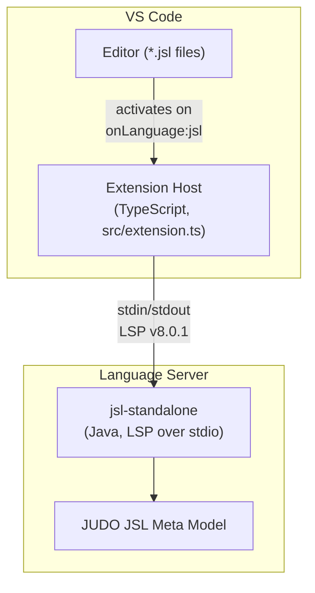
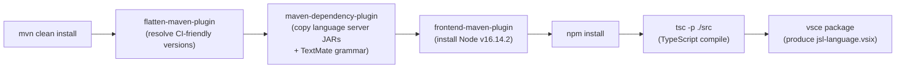
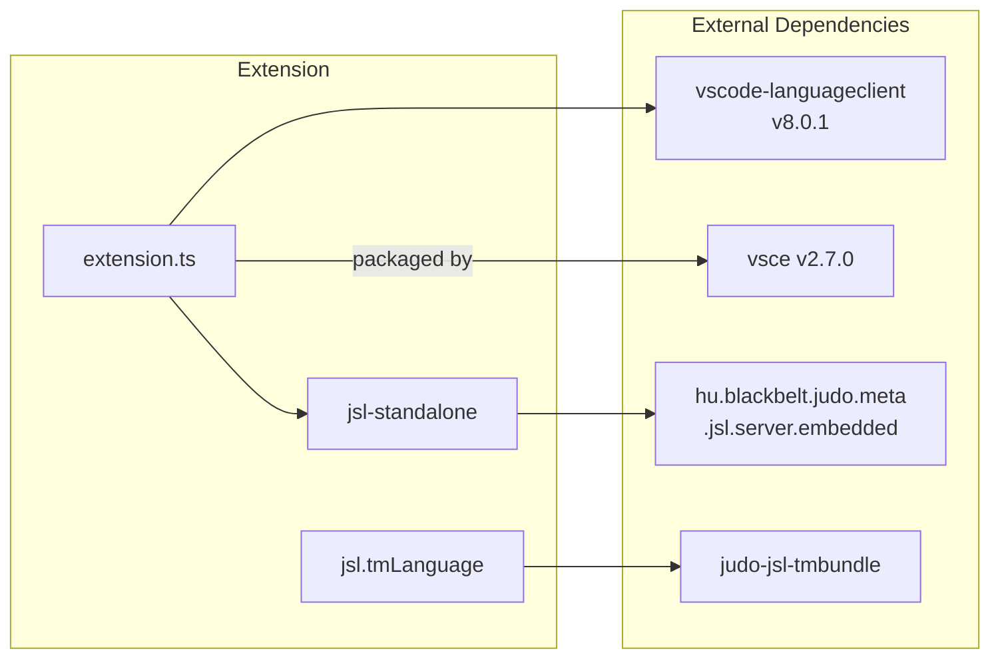

# JUDO JSL VS Code Extension

[](https://github.com/BlackBeltTechnology/judo-jsl-vscode/actions/workflows/build.yml)

## Introduction

The **JUDO JSL VS Code Extension** provides smart editing features for the JUDO Specification Language (JSL). It bundles an embedded Java-based language server that communicates with VS Code over the Language Server Protocol (LSP), providing code completion, diagnostics, symbol lookup, and more for `.jsl` files.

The extension is built and packaged as part of the Maven build pipeline — the frontend plugin handles Node.js installation, TypeScript compilation, and VSIX packaging automatically.

## Architecture



The extension activates lazily when a `.jsl` file is opened. The TypeScript extension host (`src/extension.ts`) spawns the bundled Java language server (`src/jsl/bin/jsl-standalone`) as a child process and communicates using LSP over stdio.

## Build Lifecycle



## Installation

The extension is not yet published to the VS Code Marketplace. Install manually from a VSIX file:

1. Download `jsl-language.vsix` from the [latest release](https://github.com/BlackBeltTechnology/judo-jsl-vscode/releases).
2. Open the Extensions panel in VS Code.
3. Click the three-dot menu (**...**) and select **Install from VSIX...**.
4. Select the downloaded `jsl-language.vsix` file.

## Development

### Prerequisites

- **Java 21** JDK
- **Maven 3.9.4+**
- Node.js is managed automatically by `frontend-maven-plugin` (v16.14.2)

### Build

```sh
# Full build — compiles TypeScript, bundles language server, produces VSIX
mvn clean install

# TypeScript compilation only
npm run compile

# TypeScript watch mode for iterative development
npm run watch
```

### Debugging

Use the included `.vscode/launch.json` to launch the extension in a new VS Code window (`--extensionDevelopmentPath`). Java remote debugging is available on port 8000 via `JAVA_OPTS` set in `createDebugEnv()`.

## Dependency Graph



## Context

This project is a building block of the [judo-community](https://github.com/BlackBeltTechnology/judo-community) aggregator project. See the corresponding documentation for how this module fits into the ecosystem.

## Contributing

See [CONTRIBUTING.md](CONTRIBUTING.md) for contribution guidelines.

## License

This project is licensed under the [Eclipse Public License 2.0](https://www.eclipse.org/org/documents/epl-2.0/EPL-2.0.txt).
